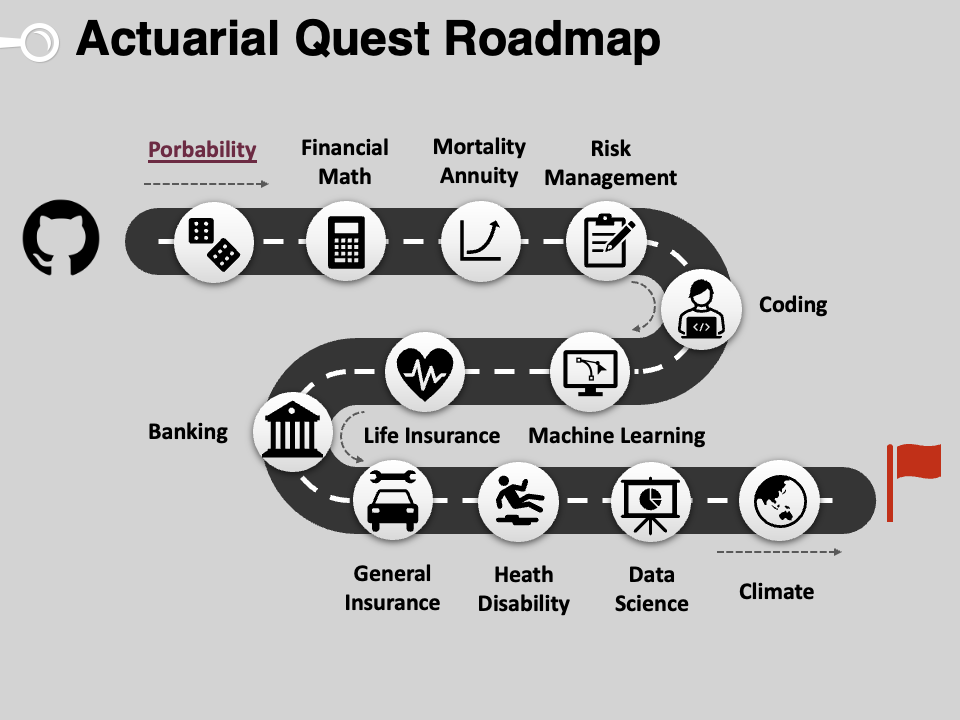

# Introduction to Actuarial Studies 

_"Tell me and I forget. Teach me and I remember. Involve me and I learn" - Benjamin Franklin_

---

# Actuarial Exam Pathways Comparison

This table provides a detailed comparison of the subjects and exam codes between the Institute and Faculty of Actuaries (IFOA) and the Society of Actuaries (SOA).

| IFOA Code | IFOA Subject                             | SOA Code         |
|-----------|------------------------------------------|------------------|
| CS1       | Actuarial Statistics                     | P, VEE MS        |
| CS2       | Risk Modelling and Survival Analysis     | SRM, FAM         |
| CM1       | Actuarial Mathematics                    | FAM, AL(S)TAM    |
| CM2       | Economic Modelling                       | FAM, VEE Acc/Fin |
| CB1       | Finance                                  | VEE Acc/Fin      |
| CB2       | Economics                                | VEE Econ         |
| CB3       | Management                               | VEE Acc/Fin      |
                                                                      

| SOA Code | SOA Subject                                 | IFOA Code         |
|----------|---------------------------------------------|-------------------|
| P        | Probability                                 | CS1               |
| FM       | Financial Math                              | CM1               |
| FAM      | Fundamentals of Actuarial Math              | CM1, CM2, CS2     |
| SRM      | Statistics for Risk Modeling                | CS2               |
| PA       | Predictive Analytics                        | CS2               |
| ALTAM    | Advanced Long-Term Actuarial Math           | CM1               |
| ASTAM    | Advanced Short-Term Actuarial Math          | CS1, CS2          |

## Notes:
- **VEE** (Validation by Educational Experience) subjects require specific college-level coursework.
- **PA** (Predictive Analytics) focus on developing practical skills and analytical techniques needed for predictive modeling in actuarial practices.
- **AL(S)TAM** (Advanced Long or Short-Term Actuarial Mathematics) covers detailed aspects of either long-term or short-term actuarial mathematics.

This mapping provides a comprehensive view for aspiring actuaries on how to leverage their studies to meet the examination and qualification requirements of both IFOA and SOA.
* [Probability](probability.md)
* [Financial Mathematics](financial_math.md)
* [Life Insurance](life.md)
* [Statistical Machine Learning](statsml.md)
