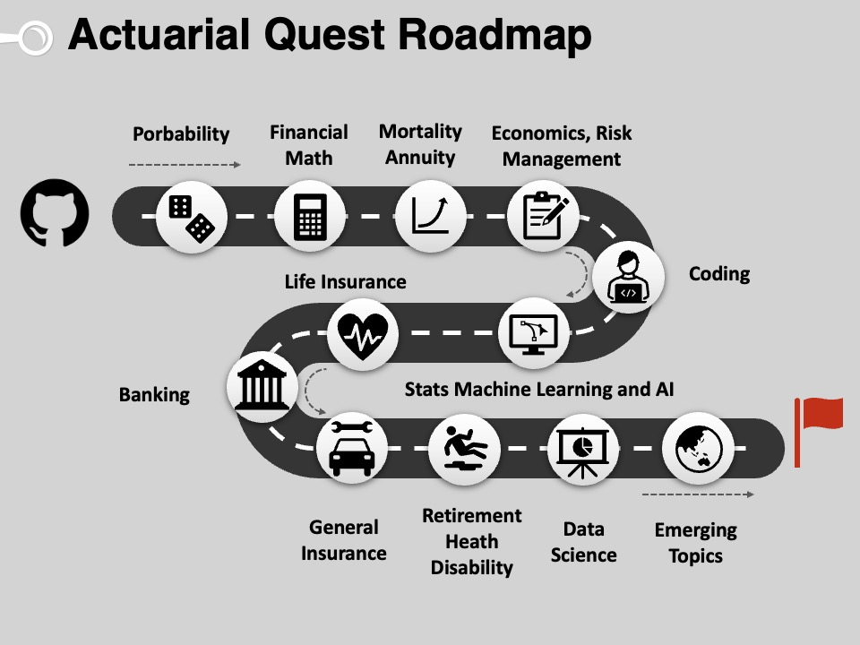

# Introduction to Actuarial Studies 

_"Tell me and I forget. Teach me and I remember. Involve me and I learn" - Benjamin Franklin_

---

# Actuarial Exam Pathways Comparison

This table provides a detailed comparison of the subjects and exam codes between the Institute and Faculty of Actuaries (IFOA) and the Society of Actuaries (SOA).

| IFOA Code | IFOA Subject                             | SOA Code         | SOA Subject                                                                                           |
|-----------|------------------------------------------|------------------|-------------------------------------------------------------------------------------------------------|
| CS1       | Actuarial Statistics                     | P and VEE MS     | Probability and VEE Mathematical Statistics                                                           |
| CS2       | Risk Modelling and Survival Analysis     | SRM and PA       | Statistics for Risk Modeling and Predictive Analytics                                                 |
| CM1       | Actuarial Mathematics                    | FAM and AL(S)TAM  | Fundamentals of Actuarial Math and Advanced Long-Term or Short-Term Actuarial Mathematics            |
| CM2       | Economic Modelling                       | FM               | Financial Math                                                                                        |
| CB1       | Finance                                  | VEE Acc/Fin      | VEE Accounting and Finance                                                                            |
| CB2       | Economics                                | VEE Econ         | VEE Economics                                                                                         |
| CB3       | Management                               | VEE Acc/Fin      | VEE Accounting and Finance                                                                            |

## Notes:
- **VEE** (Validation by Educational Experience) subjects require specific college-level coursework.
- **FAP** (Fundamentals of Actuarial Practice)
- **PA** (Predictive Analytics) focus on developing practical skills and analytical techniques needed for predictive modeling in actuarial practices.
- **AL(S)TAM** (Advanced Long or Short-Term Actuarial Mathematics) covers detailed aspects of either long-term or short-term actuarial mathematics.

This mapping provides a comprehensive view for aspiring actuaries on how to leverage their studies to meet the examination and qualification requirements of both IFOA and SOA.
* [Probability](probability.md)
* [Financial Mathematics](financial_math.md)
* [Life Insurance](life.md)
