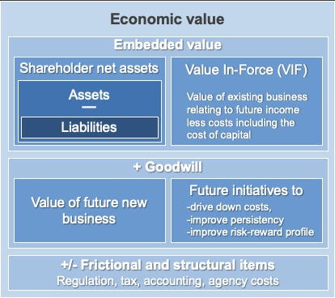
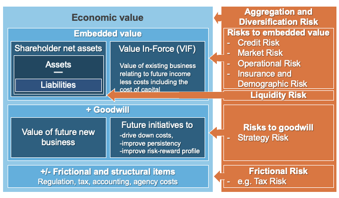

# Banking

---

## Motivation

### Actuaries in Banking

- Actuaries work across a range of banking roles:
  - Front-office investment banking (19%)
  - Middle-office finance (17%)
  - Credit risk related roles (19%)

- Motivations for a Banking Career:
  - Broader career opportunities (31%)
  - Variety of work (26%) compared to traditional areas
  - Reflected in the wide range of current roles of survey respondents

---

## ERM and Risk Classification

### Risks Faced by Organizations

- The possibility of events (or combinations of events) occurring which have an adverse impact on the economic value of an enterprise.
- What is the 'economic value' of an enterprise?

---

### Risk Classification (ERM)

Enterprise Risk Management - Risk Classification 

---

### Introduction to Risk Categories

- **Credit Risk:** The risk of loss from a counterparty's failure to meet contractual obligations (including failure to perform them in a timely manner).

- **Market Risk:** As a result of market movements, a firm may be exposed to fluctuations in the value of its assets, liabilities, or income from its assets.

- **Operational Risk:** The risk of loss, resulting from inadequate or failed internal processes, people and systems, or from external events.

---

### Introduction to Risk Categories - 2

- **Insurance and Demographic Risk:** The risk of adverse variation in life and general insurer and pension fund claim experience as well as more general exposure to adverse persistency and other demographic experience.

- **Liquidity Risk:** The risk that a firm, although solvent, either does not have available sufficient financial resources to enable it to meet its obligations as they fall due, or can secure such resources only at excessive cost.

---

### Introduction to Risk Categories - 3

- **Strategy Risk:** Threats to the realization of the goodwill of a firm in relation to future new business and projects to extract greater value from existing business.

- **Frictional Risk:** The risk of changes in accounting and regulatory capital rules; inefficiencies in operating structure; the problems caused by intra-group exposures; and distortions and asymmetries caused by (changes in) tax.

- **Aggregation and Diversification Risk:** The risk that the aggregate of risks across individual categories is greater than the sum of the individual parts and/or that anticipated diversification benefits are not fully realized.

---

## Credit Risk

### Credit Risk

- The risk of loss a firm is exposed to if a counterparty fails to perform its contractual obligations.
  - Default does not necessarily mean legal bankruptcy.
  - Failure to fulfill contractual obligations in a timely manner due to inability or unwillingness.

---

### Credit Risk Categories

Can be identified by source of credit risk:

**1. Bonds:**
- Corporate bonds
- Structured bonds (RMBS, CMBS, ABS, CDOs)
- Quasi-government bonds (municipal, supra-national)
- Sovereign bonds

**2. Retail lending:**
- Retail mortgages
- Other secured retail lending
- Credit cards and overdrafts
- Other unsecured retail lending

---

### Credit Risk Categories - 2

Can be identified by source of credit risk:

**3. Corporate lending:**
- Commercial mortgages
- Other secured commercial lending (e.g., Asset finance, trade finance)
- SME unsecured lending
- Wholesale unsecured lending (e.g., syndicated loans)

- 4. Deposit counterparties
- 5. Money market counterparties
- 6. Tenant default
- 7. Over-the-counter (OTC) counterparty default

---

### Credit Risk Categories - 3

Can be identified by source of credit risk:

- 8. Derivative exchanges and clearing house counterparty default risk
- 9. Securities lending counterparty default risk
- 10. Dealing and settlement counterparty default risk
- 11. Custodian counterparty default risk (this should be mitigated by ring-fencing of assets from those of the custodian)
- 12. (Re)insurer default relating to default of an insurer and resulting loss of cover (as distinct from any loss on investment products issued by that insurer)

---

### Credit Risk Management

Effective management of credit risk is:
- A challenge faced by all companies
  - Both financial and non-financial institutions face credit risk exposures besides the default risk associated with lending activities 
  - Example: Account receivables, investment activities, and counterparty and business partner exposures are relevant to any industry.

- A critical success factor for financial institutions (banking institutions)
  - Approximately 80% of the average capital is held against credit risk
  - Risk that institutional and individual borrowers may default on loans
  - Must underwrite and price each loan according to its credit risk, ensuring the overall portfolio of loans is well diversified

---

### Traditional Approach to Credit Risk

Traditional banking calls for each exposure to be individually underwritten: **Four Cs of credit underwriting**:

- **Character:** Integrity: Check the business history of the counterparty
- **Capacity:** Ability of the counterparty to service the debt (principal and interest) on the exposure, with a focus on free cash flow
- **Capital:** Financial resources of the counterparty other than those arising from the loan itself
- **Conditions:** Exogenous factors applicable to the economy, industry, or region

---

### Traditional Approach to Credit Risk - 2

Traditional banking calls for each exposure to be individually underwritten: **More Cs**:

- **Collateral:** Right to seize property or other assets if the counterparty defaults 
  - Should be viewed as an exit strategy, rather than an excuse for entering into a loan
  - The collateral rights can only be exercised if the counterparty doesn't have the capacity to service the debt

- **Covenants:**  Binding promises made by the counterparty to constrain its future behavior
  - Keeping total leverage within a prescribed max

---

### Modern Approach to Credit Risk

Credit Risk Management

- The identification, quantification, monitoring, controlling, and management of credit risk at both the transaction and portfolio level

- The level and volatility of future losses are inherently uncertain 

- Use statistical analysis and models to quantify losses as input to underwriting, pricing, and portfolio decisions

- Probabilistic approach: losses are considered to be stochastic, actual losses are expected to follow a probability distribution

---

### Key Credit Risk Concept

**Loss = Default x Severity x Exposure**

- **Loss:** Actual economic loss to the organization as a result of a credit event

- **Default:** Random variable - either 1 or 0 (single counterparty/transaction) / represent overall default rate of a portfolio 

- **Severity:** The fraction of the total exposure that is actually lost (can be reduced by collateral arrangements, debt covenants, etc.)

- **Exposure:** The loan amount or market value of securities that the organization is due to receive from the counterparty at the time of the credit event

---

### Expected Loss (EL)

**Expected Loss (EL):** Anticipated average rate of loss (reasonably predictable) that an organization should expect to suffer on its credit risk portfolio over time
- Effectively a cost of doing business
- Should be reflected directly in transaction pricing (don't need to hold capital against EL) 

$$
\text{Expected Loss (EL)} = \text{PD} \times \text{LGD} \times \text{EAD}
$$

- Probability of Default (PD): Expected default frequency
- Loss Given Default (LGD): 'Severity', net loss in the event of default
- Exposure at Default (EAD): Expected exposure at the time of the credit event

---

### Probability of Default (PD)

**Expected default frequency:**

- Probability that an obligor will default before the maturity
- Reflect the underlying credit risks of the particular counterparty
- Derived from observed defaults, reference data sets, counterparty's credit rating, statistical models

---

### Loss Given Default (LGD)

**Net loss in the event of default**

- Economic loss: lost principal and interest + recovery and transaction costs + delays
- Expressed as a percentage of the exposure at the point of default
- A function of facility type (e.g., bank loans, bonds), seniority (e.g., senior bond, junior bond) and collateral (e.g., secured bond, unsecured bond)
- Recovery rates for publicly traded bonds can be obtained from the major rating agencies (e.g., if recovery rate = 60%, then LGD = 40%); other facilities and transactions - few public data, must be estimated from firm's own recovery data

---

### Exposure at Default (EAD)

**Expected exposure at the time of the credit event**   

- Depends on the type of transaction and on the occurrence of future random events
- Loans: Usually outstanding amount 
- Trading exposures: Expected exposure needs to be modeled (e.g., expected exposures of long-dated transactions - swaps or forwards)

---

### Expected Loss - Example

- A $10 million one-year loan with a credit rating of 'BB' by S&P. The loan is collateralized with real estate.
- The probability of default derived from the credit rating is 0.72%.
- The loss in the event of a default for a similar loan is estimated at 60%.
- What is the expected credit loss?

$$
\text{Expected Loss (EL)} = \text{PD} \times \text{LGD} \times \text{EAD}
$$

$$
= 0.72\% \times 60\% \times \$10 \text{ million}
$$

$$
= \$43,200
$$

---

# Unexpected Loss (UL)

**The standard deviation ($\sigma$) of credit losses**

- More important measure of risk than EL
- Represents the **volatility of actual losses** that will occur around the expected level
- Existence of UL creates the need for a capital 'cushion' to safeguard the viability of the organization if losses turn out to be unexpectedly high
- Some UL are SO unlikely - uneconomic to hold capital against them (sets the risk of failure a firm is willing to tolerate)

---

# Credit Risk Models

- **Credit rating**: Issued by credit rating agencies like Moody's, S&P, Fitch
- **Credit scoring**: Binomial classification system - score $\geq$ discrimination threshold $\rightarrow$ take action (e.g., extend credit)
- **Structural models**: Based on the structure of a company's balance sheet
- **Reduced form models**: Estimating default probabilities with a broad array of explanatory variables, including macro-economic factors
- **Credit migration models**: Consider the risk that an investment will lose (or gain) value due to changes in the corporation's credit rating

